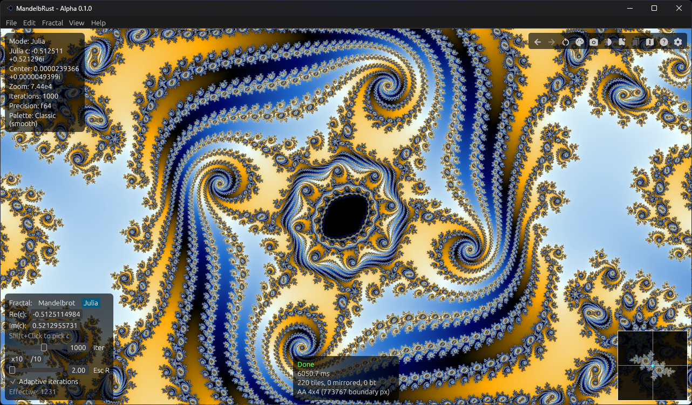
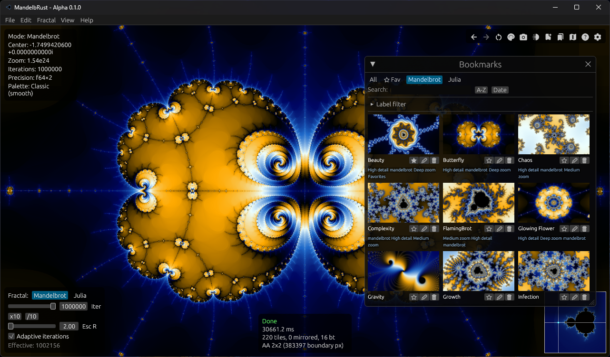
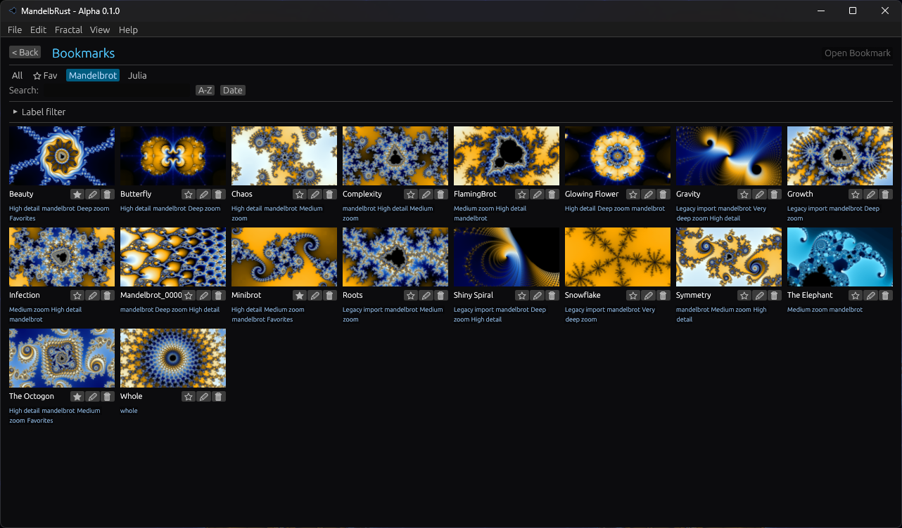
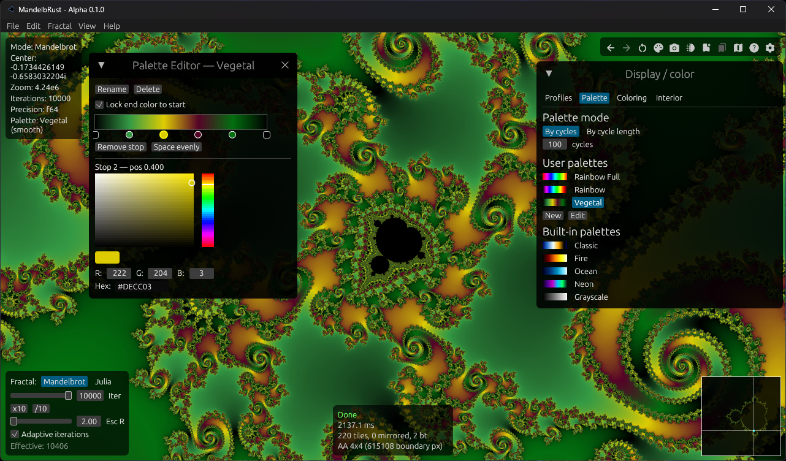
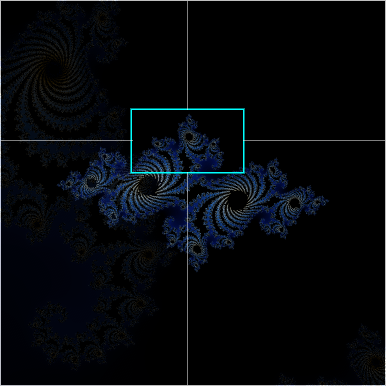
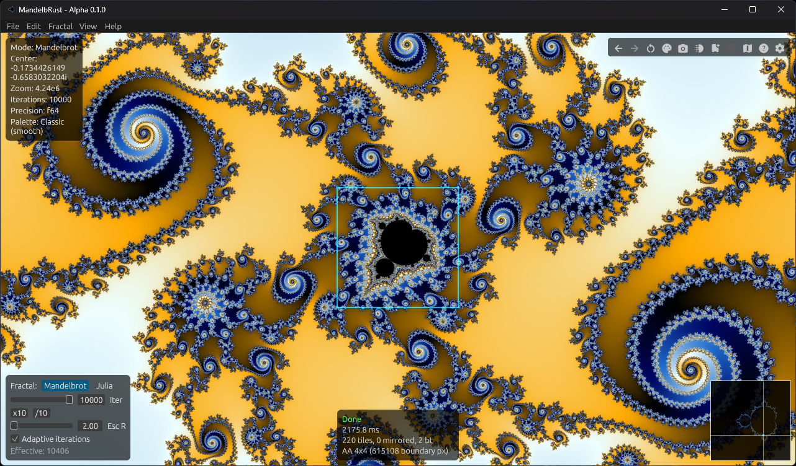
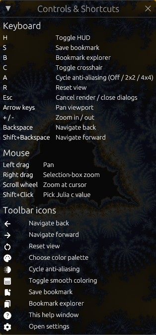

<p align="center" style="margin-bottom: 0em;">
  
</p>
<h1 align="center">MandelbRust</h1>
<p align="center">A high-performance, native fractal explorer written in <strong>Rust</strong>.</p>

<p align="center">
  
</p>

MandelbRust provides real-time, interactive exploration of the Mandelbrot set and Julia sets using a Google Maps-like navigation model. It is built around heavy multithreading, progressive rendering, and a clean separation between math, rendering, and UI.

This project is the modern successor to [MSZP](https://github.com/TonyVallad/MSZP), a QBasic fractal explorer by the same author.

## Status

**Active development** — Phases 0–10 and 10.5 complete. The core explorer is fully functional with real-time rendering, multiple color palettes, adaptive anti-aliasing, a persistent bookmark system, J preview panel (Phase 10.5), and an optimized release profile (LTO, parallel colorization, cached hot-loop values).

## Current Features

- **Real-time exploration** — smooth pan and zoom with mouse, keyboard, and Google Maps-style controls
- **Mandelbrot & Julia sets** — switch modes via the fractal parameters panel. **Click "Julia"** in the bottom-left to open the **Julia C Explorer** (grid of previews); pick a cell to set c and switch to Julia mode. In Julia mode, edit **Re(c)** and **Im(c)** in the bottom-left (DragValue, ±2, 10 decimals) or Shift+Click on the main view to pick c. **J** toggles a **preview panel** above the minimap: in Mandelbrot mode, live Julia preview at cursor (left-click to load Julia at that c); in Julia mode, Mandelbrot preview with crosshair at c. Preview uses same size/opacity as minimap, 4×4 AA; Julia preview iterations configurable (250 default)
- **Multithreaded tiled renderer** — parallel CPU rendering via Rayon with automatic load balancing
- **Progressive rendering** — instant low-resolution preview on a background thread, asynchronous refinement to full quality
- **Computation optimizations** — cardioid/bulb checks, periodicity detection (Brent's), real-axis symmetry, border tracing
- **5 color palettes** — Classic, Fire, Ocean, Neon, Grayscale with smooth coloring and a popup palette picker for instant switching
- **Adaptive anti-aliasing** — boundary-aware supersampling (2×2 / 4×4) that targets only edge pixels
- **Pan optimization** — preserves rendered quality during drag; only newly exposed edges are re-rendered
- **Bookmark system** — self-contained, one-file-per-bookmark JSON storage with embedded base64 PNG thumbnails for easy sharing
- **Bookmark explorer** — search, sort (A-Z / date), fractal tabs, independent favorites toggle, hierarchical label filtering (whitelist / blacklist), scrollable thumbnail grid
- **Update or save new** — pressing S (or the toolbar icon) after opening a bookmark offers to update it in-place or save a new one
- **Configurable bookmarks directory** — set from Settings with a native folder picker; default is a `bookmarks/` folder next to the executable
- **Application preferences** — persistent settings (stored next to the exe); window size, defaults, restore-last-view, and bookmarks folder
- **Legacy import** — old MSZP save files can be imported as bookmarks
- **Adaptive iterations** — max iterations scale automatically with zoom depth
- **Material Symbols icon toolbar** — top-right icon bar with state-aware dimming (navigation, palette, AA, smooth coloring, bookmarks, help, settings)
- **Four-corner HUD** — viewport info (top-left), icon toolbar and cursor coords (top-right), fractal parameters (bottom-left), render stats (bottom-right); toggle all with H
- **Controls & shortcuts window** — lists all keyboard, mouse, and toolbar actions in a clean reference panel
- **Selection-box zoom** — right-click drag to zoom into a drawn rectangle
- **Crosshair & center marker** — toggle for precise navigation
- **Minimap** — overview of the current fractal (Julia set in Julia mode, default Mandelbrot view in Mandelbrot mode) with cyan viewport rectangle; crosshairs only outside the rect; 1px white border (75% opacity), no black margin; inset from corner like other HUD panels; rendered with 4×4 AA; toggle via toolbar or **M**; configurable size and opacity in Settings
- **J preview panel** — **J** toggles a panel above the minimap (same size, shape, opacity; gap = HUD margin; 4×4 AA). In **Mandelbrot** mode: live Julia preview at cursor c (250 iterations default, configurable); left-click loads Julia at that c. In **Julia** mode: Mandelbrot preview with white crosshair at current c (uses minimap iterations); updates when c or display/color change
- **Session persistence** — full display/color settings (palette, smooth coloring, palette mode, etc.) and last view are saved on exit and restored on startup

## Bookmark Explorer

<p align="center">
  
</p>

<p align="center">
  
</p>

Save, search, filter, and jump to exploration states. Each bookmark is a self-contained JSON file with an embedded thumbnail, making it easy to share locations by simply copying a file.

## Color Palettes & Controls

<p align="center">
  
</p>

Five built-in palettes with smooth coloring. The palette picker popup lets you preview and switch palettes instantly — no re-render needed.

## Minimap

<p align="center">
  
</p>

The minimap shows a zoomed-out overview of the **current fractal**: in Julia mode it shows the Julia set for the current c; in Mandelbrot mode it shows the default Mandelbrot view. The **cyan rectangle** is your current viewport; white crosshair lines run from the minimap edges to the rectangle (not inside it). The minimap has a 1px white border (75% opacity) with no black margin, is inset from the bottom-right corner like other HUD panels, and is rendered with 4×4 anti-aliasing. Toggle it from the toolbar (map icon) or with **M**. In Settings you can choose size (Small / Medium / Large) and opacity (default 75%).

## Controls

### Mouse

| Action | Effect |
|---|---|
| Scroll wheel | Zoom at cursor |
| Left-drag | Pan |
| Left-click (Mandelbrot, J preview on) | Load Julia at cursor c (switch to Julia mode) |
| Right-drag | Selection rectangle zoom |
| Shift + Click | Set Julia constant (in Julia mode) |

<p align="center">
  
</p>

Right-click and drag to draw a selection rectangle, then release to zoom into that region.

### Keyboard

| Key | Action |
|---|---|
| Arrow keys | Pan viewport |
| `+` / `-` | Zoom in / out |
| `R` | Reset view |
| `H` | Toggle entire HUD (hides all overlays, toolbar, panels) |
| `C` | Toggle crosshair |
| `A` | Cycle AA (Off / 2×2 / 4×4) |
| `S` | Save / update bookmark |
| `B` | Toggle bookmark explorer |
| `M` | Toggle minimap |
| `J` | Toggle preview panel above minimap (Julia preview in Mandelbrot / Mandelbrot preview at c in Julia) |
| `Backspace` | View history back |
| `Shift+Backspace` | View history forward |
| `Escape` | Close dialogs / help / settings, cancel render |

### Toolbar Icons & Help

<p align="center">
  
</p>

Navigate back/forward, reset view, palette picker, cycle AA, smooth coloring, save bookmark, bookmark explorer, minimap, controls & shortcuts, settings — all accessible from the icon bar. Stateful icons (AA, smooth coloring, bookmarks panel) dim when off; the save-bookmark and minimap icons stay bright. Press the help icon to see the full reference shown above.

## Planned Features

- **High-resolution image export** — offscreen rendering at arbitrary resolution with optional supersampling
- **Animation export** (post-v1.0) — bookmark-to-bookmark zoom animations with video output
- **Deep zoom** — perturbation theory and arbitrary precision for zoom beyond 10^15
- **Additional fractal types** — Multibrot, Burning Ship, Newton, etc.

## Technology Stack

| Component | Crate |
|---|---|
| Language | Rust |
| UI | `egui` / `eframe`, `egui_material_icons` |
| Parallelism | `rayon` |
| Benchmarking | `criterion` |
| Image encoding | `image` |
| Base64 encoding | `base64` |
| Serialization | `serde`, `serde_json` |
| Config paths | `directories` |
| File dialogs | `rfd` |
| Logging | `tracing` |

No GPU required. Performance is achieved through CPU parallelism and careful architecture.

## Quick Start

```bash
# Build and run (requires Rust toolchain)
cargo run -p mandelbrust-app

# Run tests
cargo test --workspace

# Run benchmarks
cargo bench -p mandelbrust-render
```

## Project Structure

```
MandelbRust/
  mandelbrust-core/     # math, fractals, iteration engine
  mandelbrust-render/   # tiled renderer, coloring, multithreading
  mandelbrust-app/      # UI and user interaction
  docs/                 # project documentation
```

## Documentation

- [**Project Overview**](docs/overview.md) — architecture, design decisions, and full technical specification
- [**Development Roadmap**](docs/roadmap-v2.md) — phased development plan with progress tracking (Phase 7+)
- [**Original Roadmap**](docs/roadmap.md) — Phases 0–6 (all complete)
- [**Optimization Report**](docs/optimization-report.md) — technical analysis of performance opportunities

## License

This project is licensed under the [MIT License](LICENSE).
